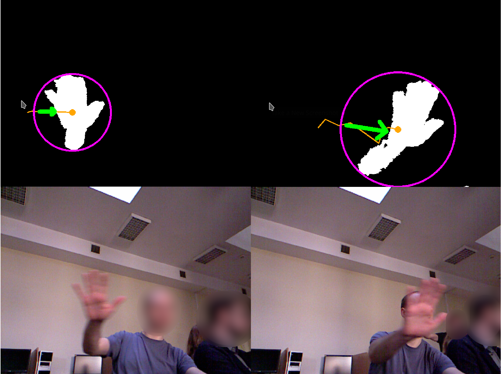

# KinectPictureBrowser

An image viewer that can be navigated with hand gestures using Kinect.

Supported hand gestures:
- left/right - previous/next picture
- up/down - zoom in/out

Implemented in C++ and Qt/QML. Tested with Kinect v1 on Linux using freenect drivers.

Motivation:

The Kinect depth map is converted into binary image using certain threshold to filter out objects far away from the sensor. 
Then, the biggest object in the image is detected using OpenCV library. 
Finally, previous object positions are used to estimate movement direction and determine if it was significant enough to trigger the gesture.

Apart from main application, an additional window can be opened to display current hand position (pink),  hand path (orange), and detected direction (green).

